
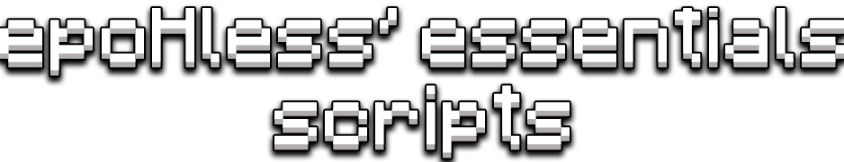

## 
 <b> Inside the project you can find various plug-and-play scripts, 

## 
 <b> meaning you just have to drop them on your gameObject to make them work.

 

### As of for now, in this project you can find scripts for:

 

Movement 🦶
 

Topdown Movement

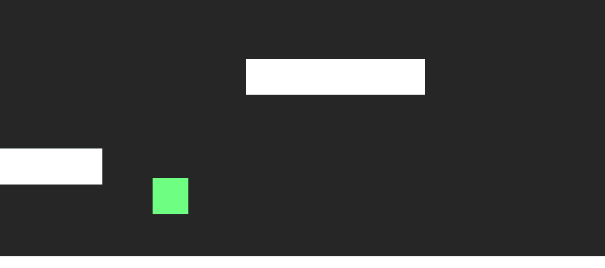

Platform Movement with jump (and double jump)

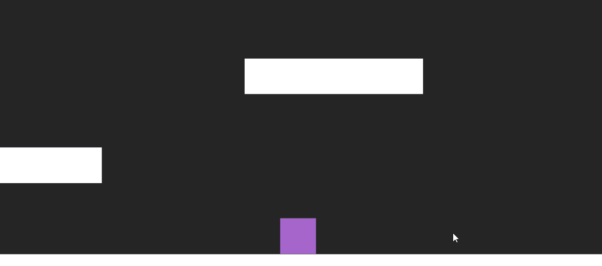

Drag and Shoot Movement

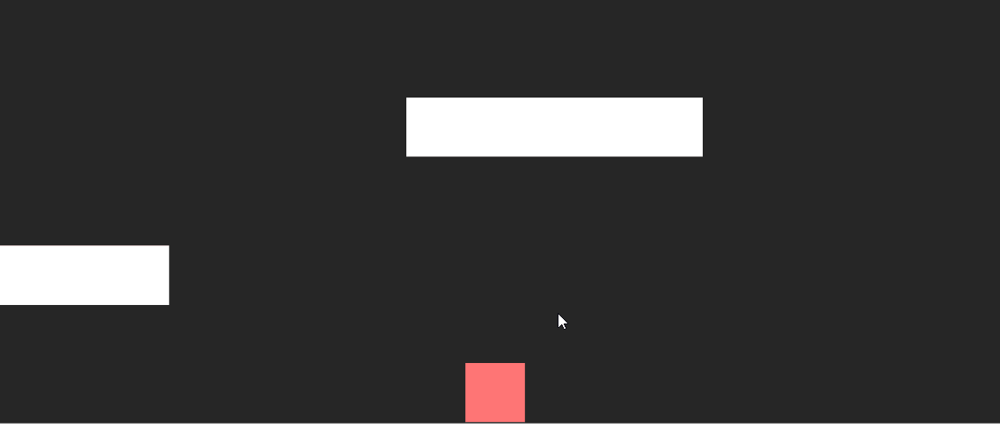

Grid based Movement

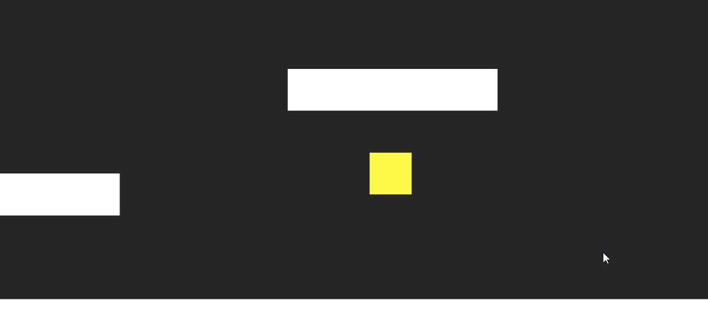

Flappy Bird like movement

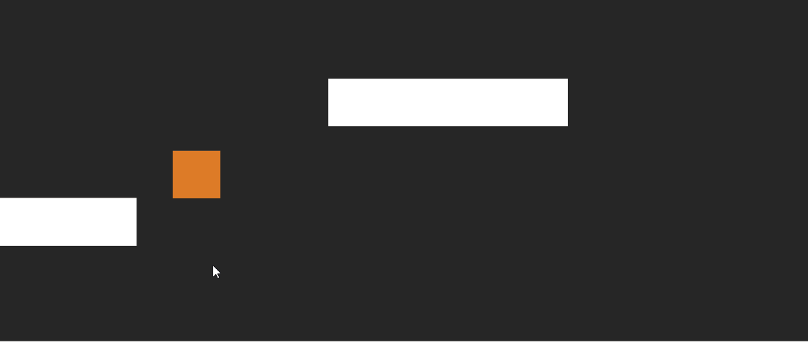

 

Dialogues 💬

    - TypeWriter Effect for text;
    - Conversation between multiple characters;
    - Scriptable object used to easily create dialogues.

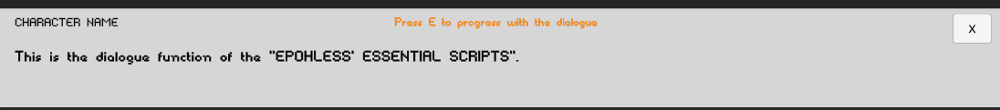

 

Health system 💖

Zelda like health system

    - Full/Empty hearths;
    - Dev can decide total amount of hearths;
    - PlayerPref ready.

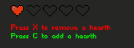

 

Quest System ❕

Quest Manager

    - Create new quests;
    - Check quests completion.

Quest Marker

    - Mark quests a completed via OnTriggerEnter or by pressing a given KeyCode inside its area.

Quest Object Activator

    - Activate/Deactivate a given object upon quest completion;
    - Could also implement UnityEvents.

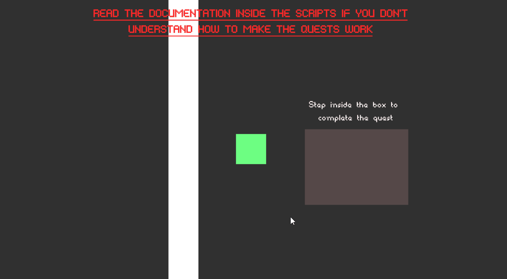

 

Platform Spawner ⬜

    - Spawn a gameObject and move it from point A to B;
    - Useful for games like Flappy Bird or Endless Runners.

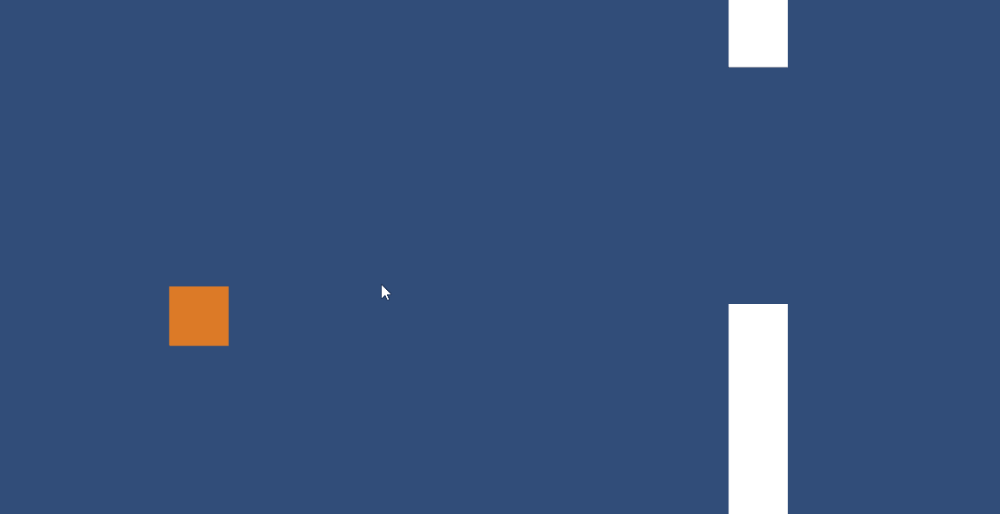

 

Audio Managment 🔉

Audio Slider

    - Dedicated custom sliders and scripts to manage audio runtimes
    - Save audio volume inside a PlayerPrefab that will save and use the value on start

Audio Toggle

    - Mute audio of a selected group of sliders
    - Value is saved in a prefab and will be set as such on start

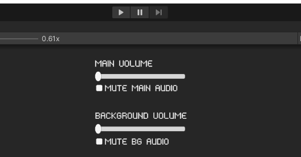

 

There's more i'm planning to add to the repository, i'll work on it for as much as i have time. 
At the moment there are 16 scripts.

 

Credits 👑

- This project uses [@PixeyeHQ](https://github.com/PixeyeHQ/InspectorFoldoutGroup) inspector foldout group to make the development cleaner;

- the hearths sprites used in the zelda like hearth system were taken from [NicoleMarieT](https://nicolemariet.itch.io/pixel-heart-animation-32x32-16x16-freebie) on itch.io;

- the font used is taken from [Void](https://arcade.itch.io/heartbit) on itch.io.

