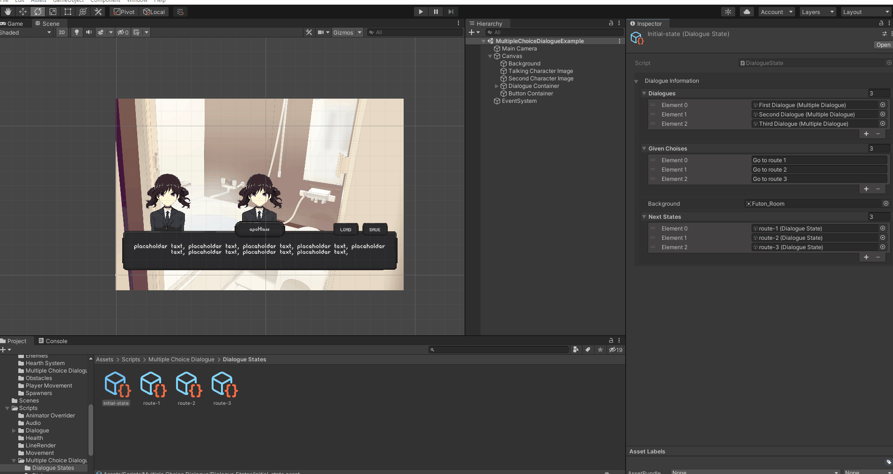
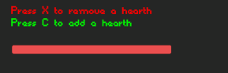
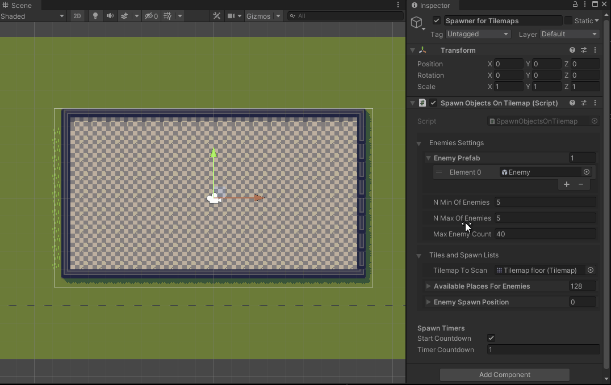
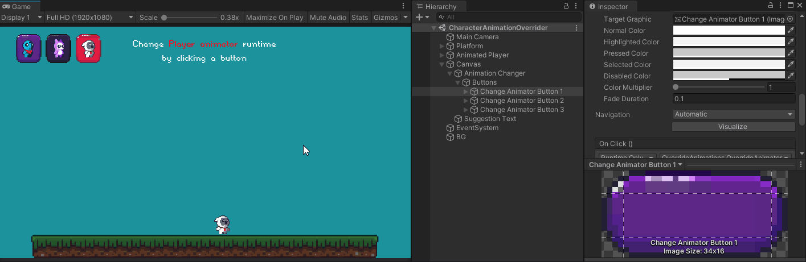

## 
 <b> Inside the project you can find various plug-and-play scripts, 

## 
 <b> meaning you just have to drop them on your gameObject to make them work.

 

### As of for now, in this project you can find scripts for:

 

Movement 🦶
 

Topdown Movement

Platform Movement with jump (and double jump)

Drag and Shoot Movement

Grid based Movement

Flappy Bird like movement

 

Dialogues 💬

    - TypeWriter Effect for text;
    - Multiple choice based dialogue;
    - Conversation between multiple characters;
    - Scriptable object used to easily create dialogues.

 

Health system 💖

Zelda like health system

    - Full/Empty hearths;
    - Dev can decide total amount of hearths;
    - PlayerPref ready.

Health slider system

    - Fully customizable slider;
    - Dev can decide total amount of HPs;
    - PlayerPref ready.

 

Quest System ❕

Quest Manager

    - Create new quests;
    - Check quests completion.

Quest Marker

    - Mark quests a completed via OnTriggerEnter or by pressing a given KeyCode inside its area.

Quest Object Activator

    - Activate/Deactivate a given object upon quest completion;
    - Could also implement UnityEvents.

 

Platform Spawner ⬜

    - Spawn a gameObject and move it from point A to B;
    - Useful for games like Flappy Bird or Endless Runners.

 

Audio Managment 🔉

Audio Slider

    - Dedicated custom sliders and scripts to manage audio runtimes;
    - Save audio volume inside a PlayerPrefab that will save and use the value on start.

Audio Toggle

    - Mute audio of a selected group of sliders;
    - Value is saved in a prefab and will be set as such on start;
    - Customizable KeyCode to quickly mute/unmute audio. 

 

Enemy Spawners 🧛‍♂️

    - Spawn a random object from an array of gameObjects
    - Select a Min/Max numbers of enemies to spawn per callback
    - Select how many enemies can be active at the same time

Spawn gameObjects inside Tilemap

Spawn gameObjects inside Area

 

Animator Overrider 🦎

    - Override the animator to change on object appearance runtime
    - Can call the function via scripts and on button click as in the example below
    - Add as many Animator Overriders as you wish and change between them via simple Functions
    - Sample scene provided

 

There's more i'm planning to add to the repository, i'll work on it for as much as i have time. 
At the moment there are 27 scripts.

 

Credits 👑

- This project uses [@PixeyeHQ](https://github.com/PixeyeHQ/InspectorFoldoutGroup) inspector foldout group to make the development cleaner;

- The hearths sprites used in the zelda like hearth system were taken from [NicoleMarieT](https://nicolemariet.itch.io/pixel-heart-animation-32x32-16x16-freebie) on itch.io;

- The font used is taken from [Void](https://arcade.itch.io/heartbit) on itch.io;

- Tilemap asset taken from [Adam Saltman](https://adamatomic.itch.io/jawbreaker) on itch.io;

- Enemy sprite taken from [0x72](https://0x72.itch.io/dungeontileset-ii) on itch.io;

- Button UIs comes from [Sumo Studio](https://sumo-studios.itch.io/pixel-art-buttons);

- Tiny Heroes come from [Free Game Assets](https://free-game-assets.itch.io/free-tiny-hero-sprites-pixel-art);

- Anime background taken from [NoranekoGames](https://noranekogames.itch.io/yumebackground);

- Anime characters from [Sutemo](https://sutemo.itch.io/female-character) customized thanks to [Exuin](https://emily2.itch.io/sutemo) character creator.

